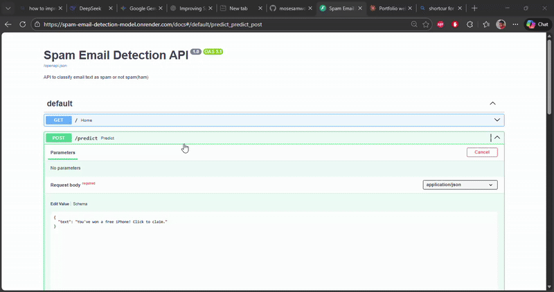

# Spam Email Detection Model

A machine learning API for detecting spam emails and messages using TF-IDF vectorization and Logistic Regression. Built with FastAPI and deployed on Render.



## Overview

This project implements a machine learning solution using TF-IDF vectorization and Logistic Regression to automatically identify and filter spam emails with high accuracy. The model is deployed as a REST API, making it simple to integrate spam detection capabilities into any application or workflow.

## Key Features

- **High-Accuracy Classification**: Trained Logistic Regression model with optimized performance
- **TF-IDF Vectorization**: Efficient text-to-vector transformation
- **REST API**: Fast, scalable API with JSON responses
- **Interactive Documentation**: Built-in Swagger UI for easy testing
- **Real-time Predictions**: Instant spam classification with confidence scores
- **Production Ready**: Deployed on reliable cloud infrastructure
- **Windows Desktop App**: Native application for easy access

## Quick Start

The API is live and ready to use. No installation required.

**Base URL**: `https://spam-email-api-ece2.onrender.com`

**Interactive Docs**: [https://spam-email-api-ece2.onrender.com/docs](https://spam-email-api-ece2.onrender.com/docs)

## Windows Desktop Application

Download the SpamCheck desktop application for Windows x64 systems.

**Repository**: [https://github.com/mosesamwoma/SpamCheck-app](https://github.com/mosesamwoma/SpamCheck-app)

**Download**: [Latest Release](https://github.com/mosesamwoma/SpamCheck-app/releases)

**Features:**
- Native Windows UI with familiar controls
- Easy copy & paste functionality
- Fast performance and quick analysis
- Secure API communication

**System Requirements:** Windows 10/11 (64-bit), 4GB RAM, Internet connection

## Local Development

### Prerequisites

- Python 3.8 or higher
- pip package manager

### Setup

1. **Clone the repository**
```bash
   git clone https://github.com/mosesamwoma/spam-email-detection-model.git
   cd spam-email-detection-model
```

2. **Create virtual environment**
```bash
   python -m venv venv
   source venv/bin/activate  # On Windows: venv\Scripts\activate
```

3. **Install dependencies**
```bash
   pip install -r requirements.txt
```

4. **Run the API locally**
```bash
   uvicorn api.app:app --reload --host 0.0.0.0 --port 8000
```

5. **Access the API**
   - API: http://localhost:8000
   - Interactive Docs: http://localhost:8000/docs

## Future Improvements

- [ ] Add API key authentication
- [ ] Implement rate limiting
- [ ] Add batch email processing
- [ ] Test additional classifiers (Naive Bayes, SVM)
- [ ] Add usage analytics dashboard
- [ ] Implement Redis caching

<<<<<<< HEAD
---
=======
---
>>>>>>> af1bdbc6f88ea9c6d5b73c11fe4aec45690b6abd
